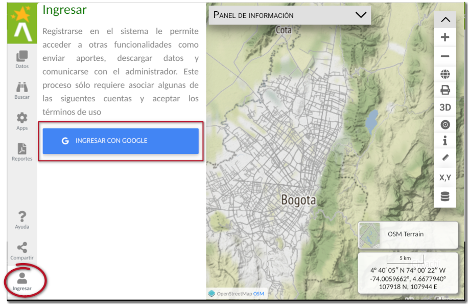
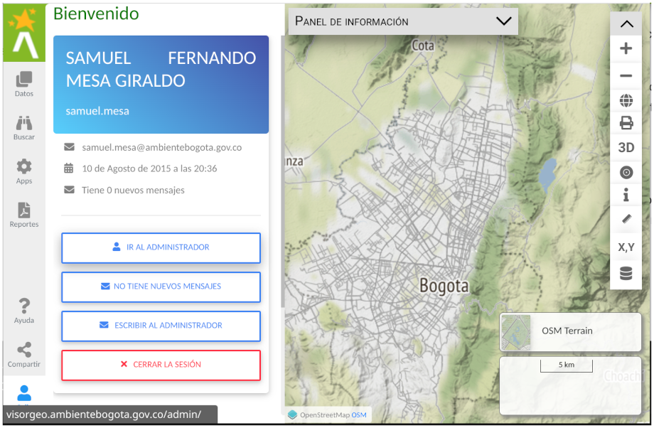

# Panel lateral de usuario y autenticación 

El proceso de registro y autenticación en el sistema se realiza mediante una cuenta de Google. Para realizar la autenticación haga clic en el botón del panel lateral con nombre Ingresar  y luego en Ingresar con **Google**.

<figure markdown>

<figcaption>Panel lateral de autenticación</figcaption>
</figure>

Seleccione la cuenta con la cual quiere autenticarse e ingresar al sistema, acepte las condiciones de uso de la aplicación y finalmente termina el proceso de registro y autenticación.

La autenticación de los usuarios al sistema, permite entre otras cosas comunicarse con el administrador del sistema y acceder a las herramientas de reporte de incidencias en las campañas ambientales de la Secretaría Distrital de Ambiente.

## Menú de Usuario

Una vez el usuario se haya autenticado en el sistema, es posible acceder a funciones adicionales, como información detallado del usuario, comunicación con el administrador, revisar la bandeja de mensajes o ingresar al administrador del sistema.

<figure markdown>

<figcaption>Menú de usuario autenticado</figcaption>
</figure>
