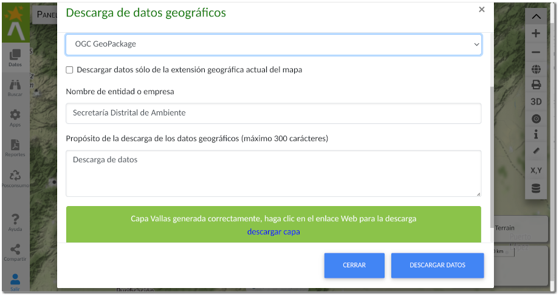

# Datos abiertos

El Visor Geográfico Ambiental, permite la descarga de datos geográficos en formatos **SIG** abiertos como *GeoPackage*, *KML* y *GeoJSON* y los formatos más comunes soportados, como *ESRI Shapefile*, así como la descarga de la información temática o atributos de la capa en formatos de hoja de cálculo como *ODS* de *LibreOffice* o *XLSX* de *Microsoft EXCEL*.

La descarga de datos geográficos de la Secretaría Distrital de Ambiente, el usuario acepta las condiciones de la [licencia abierta](https://creativecommons.org/licenses/by/4.0/deed.es) y las condiciones de uso para datos abiertos de la Infraestructura Integrada de Datos Espaciales para el Distrito Capital (**IDECA**).

## Descarga de datos geográficos

Para la descarga de datos abiertos de la Secretaría Distrital de Ambiente requiere autenticarse en el sistema, ver en *Menú de usuario* y [Autenticación en el sistema](autenticacion.md). La descarga se realiza a través del [menu contextual](navegacion.md#propiedades-de-la-capa) de opciones de la capa Geográfica y luego en la opción *Descarga de datos*. Una vez se despliega la Ventana de descarga de capas, como se muestra en la siguiente figura:

<figure markdown>

<figcaption>Ventana para la descarga de datos abiertos</figcaption>
</figure>

Para la descarga el usuario acepta la licencia y condiciones de descarga. El usuario puede seleccionar entre los posible formatos SIG abiertos como GeoPackage, KML, GeoJSON y el formato soportado de ESRI Shapefile, así como la descarga de la información temática en formatos de hojas de calculo como LibreOffice Calc ODS y Microsoft EXCEL XLSX.

Marque la opción Descargar datos sólo de la extensión geográfica actual del mapa si la descarga se realiza sólo para el contexto geográfico desplegado actualmente en el mapa.

Diligenciar el formulario de la Entidad o Empresa, y el propósito del uso de los datos. Finalmente haga clic en el botón Descargar datos para iniciar el proceso de conversión de formatos y descarga, la respuesta es un enlace Web para la descarga de datos.

## Descarga de datos geográficos Temporales

El Visor Geográfico Ambiental soporta la descarga de datos temporales, como los ofrecidos por la Red Monitoreo de Calidad del Aire de Bogotá. Tenga en cuenta para la descarga habilitar el rango de tiempo de consulta, sea mensual, trimestral o anual.
