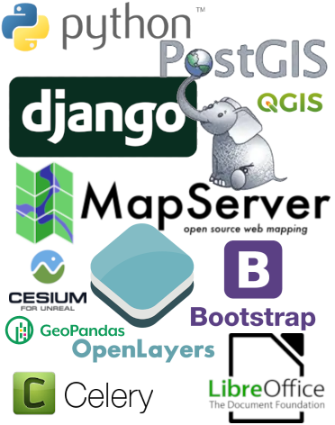

# Presentación del Visor Geográfico

El Visor Geográfico Ambiental es la herramienta implementada por la Secretaría Distrital de Ambiente de la ciudad de Bogotá, para poner a disposición de la ciudadanía, la academia, el sector público y privado la información de carácter ambiental que es de misionalidad de la entidad.

El Visor Geográfico Ambiental hace parte del Sistema de Información Ambiental de la Secretaría Distrital de Ambiente, partiendo del concepto de políticas, estándares e interoperabilidad de la Infraestructura de Datos Espaciales para el Distrito Capital (IDECA), y desarrollado con herramientas de Software Libre y de Código Abierto.

## Objetivos del Visor

Dentro de los objetivos principales del Visor Geográfico Ambiental está entre otros, la difusión de la información institucional georeferenciada, orientada al acceso y consulta de la ciudadanía sobre el estado ambiental de la ciudad, apoyado en un histórico de datos recolectados y analizados por la entidad, así como otros servicios de generación de cadenas de servicios.

## Créditos

El Visor Geográfico Ambiental, accede a diferentes servicios geográficos de la Infraestructura de Datos Espaciales para el Distrito Capital (IDECA), entre los cuales se puede mencionar los servicios web de verificación y geocodificación de direcciones, el Sistema de Gestión de Metadatos Geográficos, el mapa de referencia para Bogotá.

!!! note "IMPORTANTE"

    Para mayor información sobre la Unidad Administrativa Especial de Catastro Distrital de IDECA, acceda al Sitio web:
    
    [http://www.ideca.gov.co](http://www.ideca.gov.co).

​    
## Software libre y de código abierto

El desarrollo del Visor Geográfico Ambiental de la Secretaría Distrital de Ambiente se realizó usando herramientas de software libre y de código abierto, siguiendo los lineamientos del [Acuerdo 279 de 2007](https://www.alcaldiabogota.gov.co/sisjur/normas/Norma1.jsp?i=23574) para la promoción de este tipo de tecnologías en el Distrito Capital y la [iniciativa del software libre](https://gobiernodigital.mintic.gov.co/portal/Iniciativas/Software-libre/) del Gobierno Digital.

{ align=left }

### Las herramientas de software libre

+ **Python**: Como lenguaje de programación del lado del servidor
+ **Django**: El marco de trabajo del lado del servidor y que provee los servicios
+ **Suite de Mapserver**: Servidor de mapas, generación de servicios de caches y todo lo relacionado la OGC.
+ **Bootstrap**: desarrollo del lado del cliente y todas las librerías en el lenguaje de Javascript
+ **Openlayers y Cesium**: Librería para el despliegue del visor 
+ **Libreoffice**: Para la generación de los reportes y conversión de formatos
