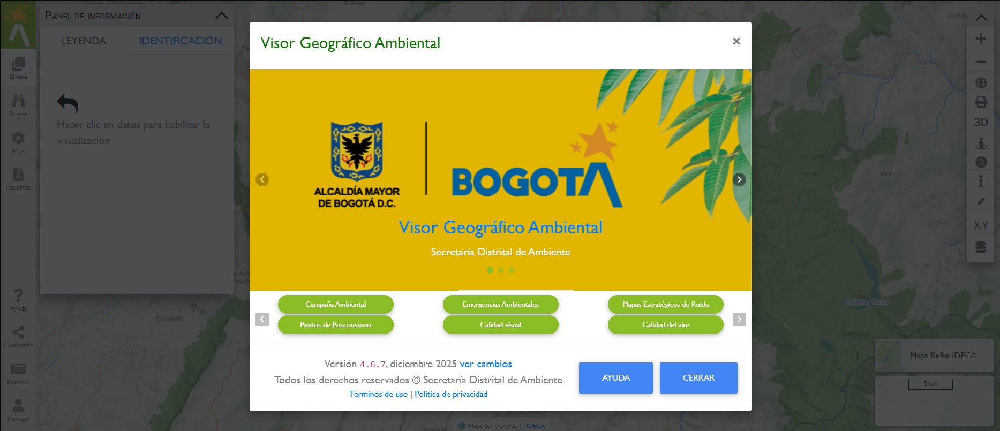

# Interfaz principal

Este manual está orientado a servir de ayuda y soporte para las diferentes funcionalidades del Visor Geográfico Ambiental a las que puede acceder la ciudadanía en la plataforma Web.

Para acceder a los servicios de información e interacción a través del Visor Geográfico, se debe contar con un navegador Web moderno que soporte los estándares abiertos de la W3C. El Visor ha sido evaluado principalmente en los navegadores Web como Mozilla Firefox, Google Chrome e Internet Explorer versión 11 o superior.

La resolución mínima de pantalla requerida para el correcto despliegue del Visor Geográfico Ambiental es de 1024x768.

Para ingresar al sistema use la siguiente URL:

!!! note "IMPORTANTE"

    [https://visorgeo.ambientebogota.gov.co](visorgeo.ambientebogota.gov.co)

El sitio Web despliega por defecto la interfaz principal con los créditos y seguimiento en redes sociales del Visor Geográfico Ambiental:   

<figure markdown>

<figcaption>Interfaz de usuario principal</figcaption>
</figure>

En la siguiente imagen se muestran los principales componentes del Visor Geográfico Ambiental.

<figure markdown>

<figcaption>Componentes de la interfaz de usuario Web principal</figcaption>
</figure>

## Menú lateral

El menú lateral se presenta enumerado como **{==(1)==}** y se encuentra a la izquierda del Visor. En este menú se encuentran los paneles de despliegue de capas, así como aplicaciones específicas. También incluye la herramienta para desplegar las opciones de compartir en redes sociales, autenticación, ayuda, noticias y créditos de conexión e interoperabilidad con Sistemas de Información Geográfica.

## Panel de información 

Corresponde al numeral **{==(2)==}** y en esta panel flotante se lleva a cabo del despliegue de la leyenda, así como de la identificación y medidas, como otra información releveante.

## Vista de mapa

Corresponde al numeral **{==(3)==}** y corresponde al despliegue de los mapas base y de las capas temáticas seleccionadas por el usuario y permite  interactuar las capas geográficas de interés desplegadas, asociadas con una simbología y etiquetado, así como comportamientos a través de las escalas y temporal.

Sobre el componente de mapa, se despliega una serie de herramientas auxiliares de navegación (10), como las de acercar, alejar y moverse a través del mapa. Estas herramientas también permiten servir como indicador del detalle de visualización en el mapa.

## Barra de herramientas

La barra de herramientas está constituida por el numeral **{==(4)==}**, y básicamente muestran todas las herramientas útiles al usuario para la navegación, consulta, herramientas de medidas, herramientas de localización y generación de la cadena de servicios.

## Panel de despliegue de mapas base

Corresponde al numeral **{==(5)==}** y permite acceder al listado de mapas base que se pueden usar como referencia con las capas temáticas ambientales. 

## Barra de estado de coordenadas

En la barra de estado se ubica en la parte inferior del Visor Geográfico y se encuentran los indicadores del mapa, que permiten al usuario conocer la escala aproximada del mapa actual, numeral **{==(6)==}**, las coordenadas geográficas o planas, vista general del mapa y avisos en la herramienta.

