# Navegación en el mapa, despliegue de capas y leyenda

En esta sección se documenta la ayuda relacionada con la interfaz principal del Visor Geográfico, específicamente en lo que refiere al despliegue de capas geográficas, las propiedades de estas capas, así como el comportamiento de su simbología y representación temporal.

Se define como capa geográfica a la serie de datos e información que se encuentra georeferenciada y adecuadamente estructurada, que representan objetos del paisaje de forma puntual, lineal o superficial. Estas capas, como abstracción de los objetos del paisaje, tienen propiedades y comportamientos que logran representarse a través de un Sistema de Información Geográfica. Las propiedades espaciales están generalmente asociadas a su geometría y a una representación de simbología y etiquetado. Las propiedades de atributos de la capa están asociadas con las características definidas por el objeto mismo, como puede ser su nombre, descripción, área y perímetro. A través del comportamiento temporal, por ejemplo, se pueden modelar las tendencias de representación de propiedades particulares a lo largo del tiempo. En el Visor Geográfico también se presenta un comportamiento de la capa, relacionado con las escalas de representación, permitiendo asociar a escalas mayores de representación, o visualizar elementos con mayor detalle, así como asociar una leyenda apropiada para una mejor interpretación por parte del usuario.

A través del Visor Geográfico Ambiental, es posible la integración de una gran variedad de información y datos geográficos, misionalidad de la Secretaría Distrital de Ambiente, que permita al ciudadano conocer la gestión ambiental de la Secretaría en el Distrito, así como llevar a cabo el análisis geográfico ambiental de su entorno.

## Herramientas de navegación

Para la interacción del usuario con el mapa del Visor Geográfico Ambiental, se dispone de varias herramientas que permiten su navegación, visualización espacial, así como de sus atributos y comportamientos de propiedades temporales.

Las herramientas de navegación se encuentran habilitadas por defecto con los eventos de ratón. Al hacer doble clic con el botón izquierdo del ratón, se realiza un acercamiento al mapa en el punto del evento. Al mantener presionado el botón izquierdo del ratón, es posible desplazar el mapa en la dirección indicada por el usuario. El botón central del ratón, en caso de contar con la rueda, permite acercar o alejar del mapa, así como al mantenerlo presionado permite el desplazamiento del mapa. Con la combinación del ratón, presionando el botón izquierdo junto con la tecla *Shift* permite realizar un acercamiento a una zona o extensión geográfica definida por el usuario. Finalmente, con el clic derecho permite acceder al menú contextual para obtener las coordenadas en el mapa. 

Las herramientas de navegación ubicadas en la barra de herramientas, como se muestra a continuación, permiten:

{ align=left }

**{==(1)==}** **Acercar en el mapa:** Esta herramienta tiene el mismo comportamiento que la opción de acercar en el mapa, permitiendo aumentar la escala del mapa o aumentar el detalle de forma gradual.

**{==(2)==}** **Alejar en el mapa:** Funciona de manera similar a la herramienta de alejar en el mapa, permitiendo disminuir la escala del mapa o disminuir el detalle del mismo de forma gradual.

**{==(3)==}** **Vista completa del mapa:** Esta opción regresa a la vista inicial o completa del mapa, enfocada principalmente a la zona urbana del Distrito.

**{==(4)==}** **Imprimir mapa:** Esta herramienta permite generar la salida del mapa en formato PDF, de acuerdo con la configuración de la ventana de imprimir mapa: extensión geográfica, título del mapa, autor, habilitar grilla, orientación del mapa e incluir la leyenda.

**{==(5)==}** **Vista mapa 3D:** Realiza el despliegue de la vista del mapa en 3D con la configuración del modelo digital de elevaciones de la ciudad.

**{==(6)==}** **Street View:** Esta opción activa la vista en 360 grados de la zona seleccionada, permitiendo al usuario explorar el entorno a nivel de calle. Utiliza las funciones del navegador Web, abriendo una nueva pestaña de Google Maps en la ubicación seleccionada.

**{==(7)==}** **Ubicación automática:** Realiza la ubicación automática usando las opciones de localización del navegador Web, en caso de dispositivos móviles el uso de GNSS.

**{==(8)==}** **Herramienta de identificación:** Permite desplegar el panel de identificación, el cual muestra información sobre las propiedades de atributos de las capas activas en el mapa. Use esta funcionalidad sobre las capas activas y retorna la información que coincide de forma interactiva en el punto del mapa.

<figure markdown>
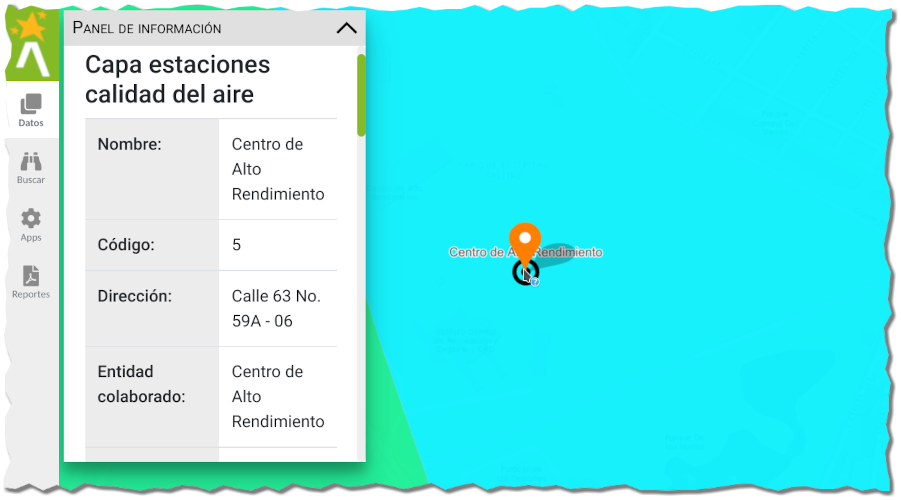
<figcaption>Panel de información e identificación</figcaption>
</figure>

**{==(9)==}** **Herramientas de medida:** 

<figure markdown>
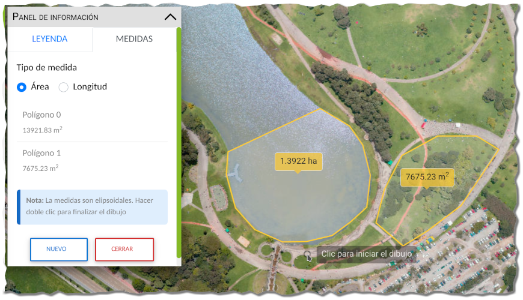
<figcaption>Panel de medida de longitud y área</figcaption>
</figure>

**Medida de longitudes:** Esta herramienta permite realizar la medición de distancias o longitudes entre dos o más puntos definidos por el usuario. Al activarla, el usuario cambia al modo de medida y debe especificar el punto de partida, los puntos intermedios y el punto final se define con doble clic. Finalmente, se reporta el valor de distancia y unidades apropiadas. Para finalizar el uso la herramienta, haga clic nuevamente sobre la misma en la barra de herramientas o sobre el botón *Cerrar* del panel de información.

**Medir áreas:** Permite obtener la información del área de un polígono dibujado por el usuario. Al activar la herramienta, el usuario tiene que definir el tipo de medida de área en el panel de medidas, y luego seleccionar el punto inicial, la secuencia de puntos y el punto final, el cierre del polígono se realiza con doble clic. Finalmente, se reporta el valor de área y unidades apropiadas. Para finalizar de usar la herramienta haga clic nuevamente sobre la misma en la barra de herramientas o sobre el botón *Cerrar* del panel de información.

**{==(10)==}** **Conversor de Coordenadas:** Esta herramienta permite realizar la conversión de coordenadas ingresadas por el usuario a diferentes sistemas de coordenadas. Al usar esta herramienta se despliega una ventana con las opciones de ingreso de coordenadas, búsqueda por coordenadas y conversión en los diferentes sistemas.

<figure markdown>
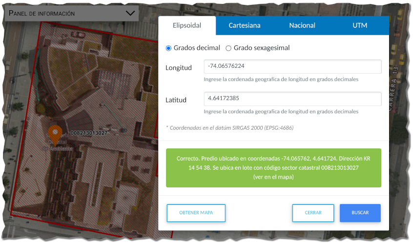
<figcaption>Búsqueda y conversión por coordenadas</figcaption>
</figure>

**{==(11)==}** **Agregar datos Externos:** Esta herramienta permite agregar una nueva capa de datos desde fuentes de geoservicios Web o de sistemas de ficheros. Los formatos soportados son *GeoJSON, CSV, SHAPEZIP, KML*. Para tablas con coordenadas puntuales, se recomienda usar el formato *CSV* con nombres de las coordenadas geográficas como ***longitude*** y ***latitude***. También permite agregar servicios *WMS* o *WFS* preconfigurados.

<figure markdown>
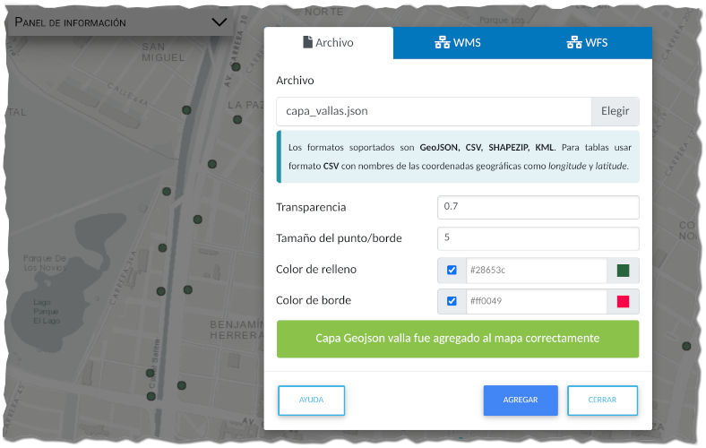
<figcaption>Agregar datos externos</figcaption>
</figure>

## Panel de capas y leyenda

El panel de capas se ubica en el panel lateral, mientras que la leyenda se despliega en la ventana flotante en la parte izquierda del Visor Geográfico. A través de este menú lateral, es posible organizar las capas geográficas, la simbología asociada y las incidencias ambientales reportadas por los ciudadanos, de manera que esté a la mano la configuración e información del mapa.

## Panel de capas geográficas

Para desplegar el panel de capas geográficas, simplemente haga clic sobre el icono **Datos**. El panel está organizado por categorías, lo que permite al usuario identificar inicialmente las temáticas de interés.

{ align=left }

**Capas temáticas:** Incluye todas las capas de carácter misional organizadas por temáticas.

**Básico Temático:** Contiene las capas complementarias a los análisis espaciales ambientales, como la densidad de población.

**Capas de usuario:** Son aquellas capas que son agregadas por el usuario desde la herramienta avanzada de agregar datos.

## Propiedades de la capa

Por cada capa geográfica, es posible cargar una serie de comportamientos y propiedades, dependiendo del icono que se encuentre habilitado actualmente en dicha capa. La siguiente imagen muestra un ejemplo de capa geográfica temática.

<figure markdown>

<figcaption>Propiedades de las capas geográficas</figcaption>
</figure>

Las capas por defecto se encuentran desactivadas en la visualización del mapa, representadas con el icono . Al hacer clic sobre este icono, es posible activar la capa, cambiando al icono .

Si la capa presenta la propiedad temporal, con el siguiente icono puede desplegar el panel de filtro y visualizar el cambio dinámico de la representación de la capa, como se muestra en la imagen a continuación :

<figure markdown>

<figcaption>Herramienta de despliegue de propiedades temporales</figcaption>
</figure>

Para desactivar la barra temporal, simplemente desactive la visualización de la capa en el mapa.

De gran importancia dentro de la Infraestructura Espacial de Datos, es el despliegue de la información propia de la capa o los metadatos, en el que entregue al usuario el detalle de producción y mantenimiento de la capa. Para desplegar el menú de opciones de la capa, entre ellas la consulta de los metadatos de la capa haga clic sobre el icono .

Esto despliega un menú emergente donde se puede acceder a las opciones de la capa, entre ellas la ventana con el metadato mínimo.

<figure markdown>

<figcaption>Menú Opciones capa geográfica</figcaption>
</figure>

<figure markdown>
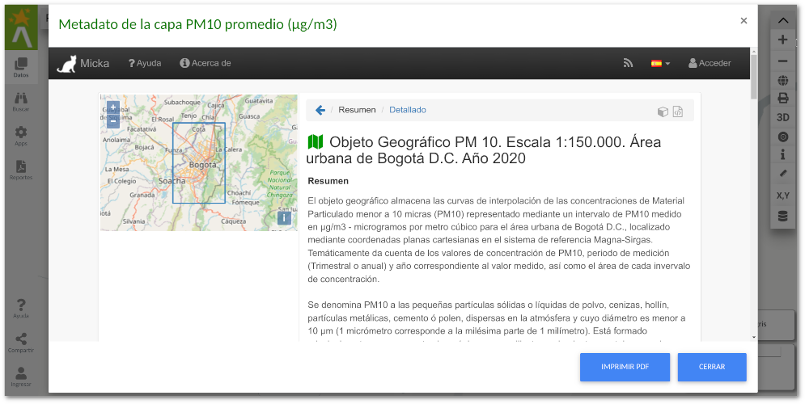
<figcaption>Despliegue de metadatos de la capa geográfica</figcaption>
</figure>

En la opción del menú emergente de la capa *Ver indicadores ambientales* **(OAB)** permite desplegar el indicador ambiental asociado a la capa en el sitio Web del proyecto de  [Observatorio Ambiental de Bogotá](https://oab.ambientebogota.gov.co/). La siguiente imagen muestra un ejemplo de despliegue de indicadores ambientales asociados a la capa:

<figure markdown>
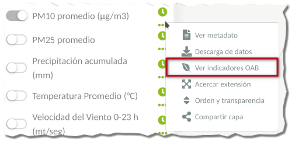
<figcaption>Menú Opciones capa geográfica</figcaption>
</figure>

<figure markdown>
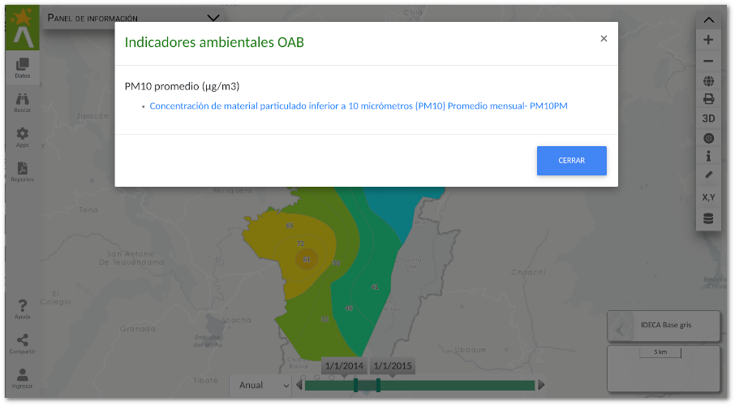
<figcaption>Despliegue de indicadores ambientales asociados a la capa</figcaption>
</figure>

Al hacer clic sobre algunos de los indicadores se redirecciona a la página del [Observatorio Ambiental de Bogotá](https://oab.ambientebogota.gov.co/).

Otra de las opciones disponibles es cambiar el orden de las capas y la transparencia de cada una ellas. Este puede ser accedido con el icono  en el panel de herramientas del panel lateral de **Datos** o través del menú contextual de cada capa.

<figure markdown>

<figcaption>Menú Opciones capa geográfica</figcaption>
</figure>

Esto despliega una ventana de la configuración de las capas, tanto el orden como la transparencia.

<figure markdown>
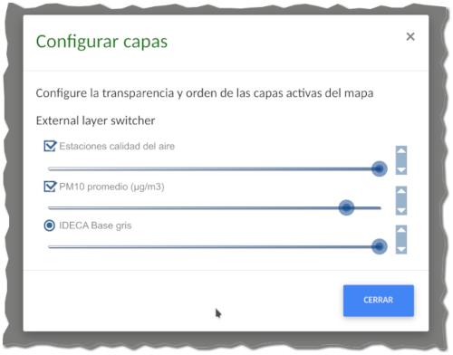
<figcaption>Menú Opciones capa geográfica</figcaption>
</figure>

## Panel de capas base

Refiere a las capas base de representación sobre las que se despliegan las capas temáticas, y permiten entregar un contexto de ubicación. Las principales capas base, son el mapa base digital y la ortoimagen del Distrito de IDECA. Las capas base se encuentran en el panel flotante en la parte inferior derecha, junto al despliegue de coordenadas. 

<figure markdown>

<figcaption>Despliegue de los mapas base</figcaption>
</figure>

## Panel de información y leyenda

El panel de información y leyenda, despliega la simbología asociada a las capas activas de visualización en el mapa. Para desplegar el panel de leyenda haga clic en una de las pestañas del panel flotante para que se despliegue la información de interés.

<figure markdown>
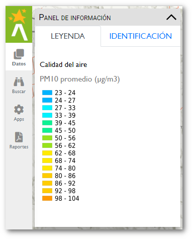
<figcaption>Panel de información y leyenda </figcaption>
</figure>

La leyenda y convenciones se organizan por las categorías definidas en el panel de capas geográficas.

La leyenda y convenciones son dinámicas en el mapa, ya que los comportamientos de la simbología de las capas cambian cuando se despliega en ciertos intervalos de escala. Esto permite un mejor representación de los elementos desde el nivel Distrital hasta nivel predial.

## Compartir mapa en redes sociales
Esta funcionalidad se encuentra habilitada en el panel lateral a través del botón de compartir configuración del mapa en las redes sociales 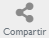 o traves de la opción *Compartir capa* en el menú contextaul de cada capa.

Al hacer clic sobre este grupo de iconos despliega las diferentes redes a través de las cuales se puede compartir la configuración del mapa.

<figure markdown>
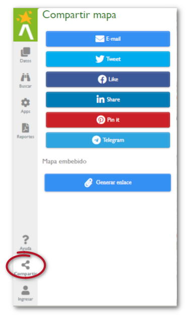
<figcaption>Opciones de compartir configuración de mapa en redes sociales </figcaption>
</figure>

Las redes sociales en su orden son [Twitter](https://twitter.com/?lang=es), [Facebook](https://es-la.facebook.com/),  [LinkedIn](https://co.linkedin.com/), [Pinterest](https://co.pinterest.com/), [Telegram](https://web.telegram.org/) y compartir a través de mensaje de correo electrónico.

Una configuración de mapa está definida por una extensión geográfica y las capas activas actuales de visualización. Al compartir en la red social el enlace del mapa, el usuario comparte la vista actual del mapa y que luego puede ser desplegado con igual configuración.

También es posible generar un enlace web de mapa embebido con las capas actualmente desplegadas, así como el contexto geográfico representado. 
