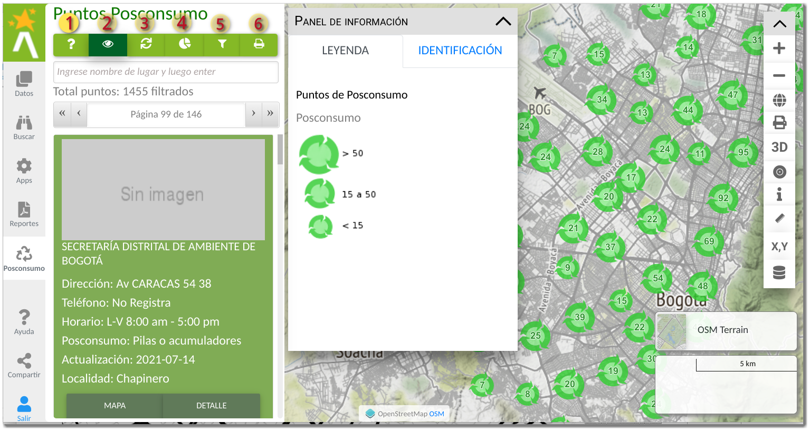
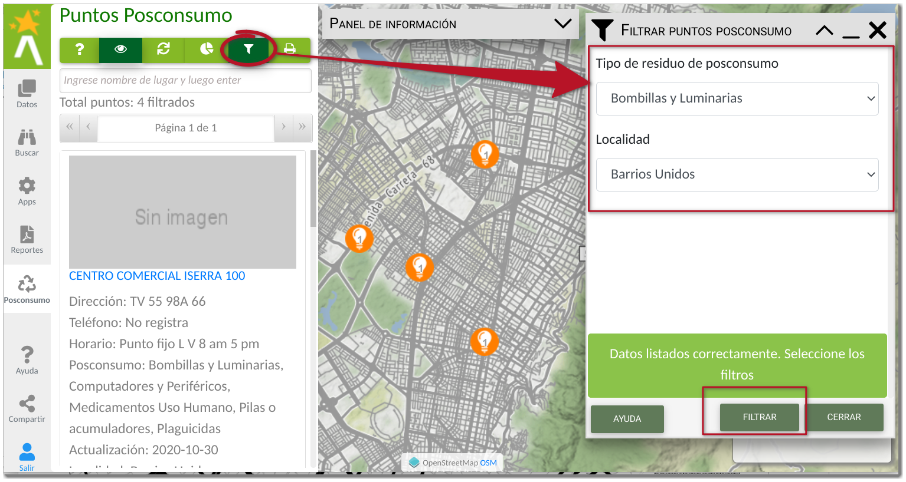

# Puntos ponsconsumo

Los puntos de posconsumo son la localización de los sitios donde se lleva a cabo la recolección de residuos que son altamente contaminantes para el ambiente y que requiere un tratamiento especial es su reutilización y desecho. Esta funcionalidad permite a los ciudadanos, primero conocer todos los puntos de limpios de la ciudad, ofreciendo la posibilidad de encontrar los puntos más cercanos a su ubicación y segundo permite recoger información de los usuarios a través de comentarios y redes sociales la actualización de funcionamiento y condiciones de estos puntos limpios y los programas de posconsumo de residuos.

Un punto de posconsumo es la ubicación puntual de un establecimiento público o privado donde de realiza la recolección de residuos, los cuales se encuentran agrupados en programas, cada uno con unas condiciones de recolección.

## Panel lateral de Posconsumo

Para acceder a la funcionalidad de puntos de posconsumo, haga clic en el botón del panel lateral con el icono de módulos y aplicaciones 

<figure markdown>

<figcaption>Panel lateral de puntos de posconsumo</figcaption>
</figure>

y luego seleccionar el módulo posconsumo. Esto permite el despliegue de la información de todos los puntos de posconsumo del Distrito Capital en el mapa y en la barra lateral. La representación en el mapa se realiza como una aglomeración o *clúster* de puntos de posconsumo, es decir muestra la concentración o ausencia de puntos en la ciudad. A medida que se realiza el acercamiento en el mapa, se encuentra el detalle de ubicación del punto de posconsumo.

<figure markdown>

<figcaption>Depsliegue de puntos ponsconsumo</figcaption>
</figure>

en el panel lateral de puntos de posconsumo, se ofrecen algunas herramientas que se detallaran en las siguientes secciones, como **{==(1)==}** consultar información sobre puntos de posconsumo, **{==(2)==}** para cambiar el estado de visualización de los puntos de posconsumo en el mapa, **{==(3)==}** refrescar el listado de puntos de posconsumo, **{==(4)==}** consultar las estadísticas relacionadas a los puntos de posconsumo, **{==(5)==}** para filtrar la lista de puntos de posconsumo y **{==(6)==}** para generar el reporte de puntos de posconsumo.

## Detalle del punto de posconsumo

Al realizar el acercamiento a los puntos de posconsumo y al hacer clic sobre alguno de los mismo, se realiza el despliegue de la ventana emergente de información resumen, al hacer clic sobre el nombre del punto o al acceder a través de los botones de detalle del panel lateral para acceder a la información del punto de posconsumo.

<figure markdown>

<figcaption>Detalle del punto de posconsumo</figcaption>
</figure>

El detalle de este punto de posconsumo muestra información del nombre del establecimiento, teléfono de contacto, horario de atención, dirección, fotografía de ubicación y la fecha de actualización de dicha información.

Este punto de posconsumo acoge algunos programas de puntos limpios, asociado a un residuo específico y unas condiciones para la recolección de dicho residuo.

Adicionalmente este punto de posconsumo puede ser compartido a través de redes sociales y contribuir a través e comentarios para recoger información por parte de la ciudadanía acerca de cambios de información del punto.

## Filtrar puntos de posconsumo

Para realizar el filtro de puntos de posconsumo por tipo de residuo y localidad haga clic sobre el botón con el icono de *Filtrar puntos posconsumo* 

esto permite el despliegue del formulario para la selección de criterios de filtro y representación final en el mapa.

<figure markdown>

<figcaption>Formulario de filtrar puntos de posconsumo</figcaption>
</figure>

Al ejecutar el filtro la representación en el mapa de los puntos de posconsumo que coincide con los criterios seleccionados se realiza por agrupación o aglomeración de puntos, es decir a mayor tamaño del icono o punto, muestra las zonas con mayor concentración. El filtro también debe mostrar la información tabular en el panel lateral que coincide con los criterios seleccionados.
