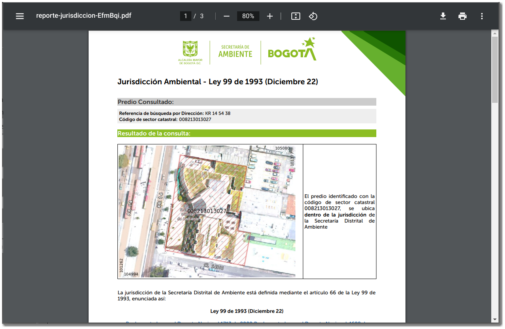

Panel lateral de Reportes Ambientales

Antes de realizar cualquier reporte es necesario que realice la ubicación predial, ver en [Menú de ubicación](ubicacion.md), de otra forma no permite continuar con la generación del reporte.

Con la localización correcta predial, es posible la generación de dos reportes:

- **Inclusión predial en determinantes ambientales:** Este reporte generado a nivel predial, permite conocer las inclusiones de áreas protegidas a nivel Distrital de acuerdo al [Decreto 555 de 2021](https://www.alcaldiabogota.gov.co/sisjur/normas/Norma1.jsp?i=119582) y demás determinantes ambientales.
- **Jurisdicción predial:** este reporte generado a nivel predial, permite conocer la jurisdicción de entidades o instituciones para trámites de carácter ambiental.
- **Respuesta a emergencia ambientales:** Reporte correspondiente al módulo de Respuesta a Emergencias Ambientales.
- **Descarga de datos abiertos:** Reporte que corresponde a las estadísticas de descargas de [datos abiertos](datos_abiertos.md) por lo usuarios.

<figure markdown>

<figcaption>Reportes Ambientales</figcaption>
</figure>

Una vez identifique el reporte, haga clic en el botón Generar reporte para crear el documento reporte. El resultado del reporte muestra un enlace para la descarga del documento

<figure markdown>

<figcaption>Resultado de la generación de reporte.</figcaption>
</figure>

!!! info "NOTA"

    Para usuarios visitantes deben ingresar el *captcha*, para usuarios autenticados y funcionarios de la SDA, pueden seleccionar a otros formatos adicionales. 

Al hacer clic en el enlace de descargar reporte, se descarga un documento en formato **PDF** con la información asociada del predio.

<figure markdown>

<figcaption>Resultado de la generación de reporte a nivel predial.</figcaption>
</figure>
