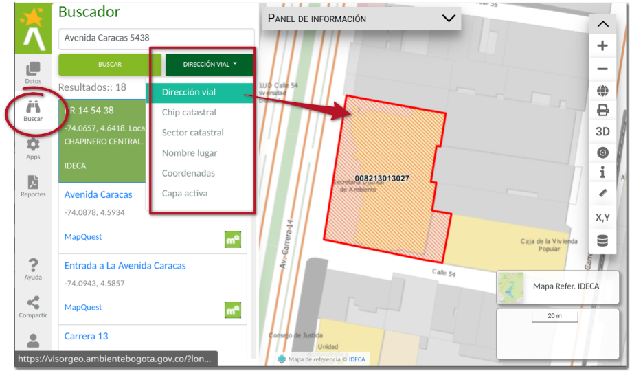

# Panel lateral de ubicación o búsqueda

Las funciones de localización y reportes permiten al ciudadano acceder a la ubicación predial y la generación de reportes que requiere por parte de la Secretaría Distrital de Ambiente. Gran parte de las funciones, son accedidas directamente de los servicios de geocodificación de **IDECA**.

Las funciones de localización se organizan en cuatro herramientas de búsqueda, entregando al usuario alternativas para la ubicación a nivel predial de manera correcta.

Las funciones de localización y reportes permiten al ciudadano acceder a la ubicación predial y la generación de reportes que requiere por parte de la Secretaría Distrital de Ambiente. Gran parte de las funciones, son accedidas directamente de los servicios de geocodificación de **IDECA**.

Las funciones de localización se organizan en cuatro herramientas de búsqueda, entregando al usuario alternativas para la ubicación a nivel predial de manera correcta.

Las opciones de búsqueda se encuentra en el panel lateral con nombre *Buscar* y representado por icono . Las opciones posibles de ubicación son:

- **Predial por dirección vial:** permite la ubicación por nomenclatura vial del predio. La dirección ingresada no debe tener caracteres especiales.
- **Predial por Chip Catastral:** permite la búsqueda predial por Chip Catastral.
- **Predial por Cédula Catastral:** permite la búsqueda predial por Sector catastral o cédula catastral del predio y debe corresponder a doce (12) dígitos.
- **Predial por Nombre de lugar:** permite la búsqueda predial por nombre de lugar o topónimo.
- **Predial por Coordenadas:** Corresponde al par de coordenadas del punto. Estas pueden se registradas en el Sistema de Coordenadas Geográficas o coordenadas planas.
- **Ubicación por capa activa** corresponde a búsqueda dentro de las capas.

El buscar por coordenadas permite ingresar los valores numéricos de las coordenadas directamente en el sistema de referencia espacial, u obtener las coordenadas directamente en el mapa.

<figure markdown>

<figcaption>Panel lateral de buscador </figcaption>
</figure>

!!! danger "IMPORTANTE"

    Las ubicaciones por marcador son aproximadas, por favor desplace el marcador hasta la posición del predio.
